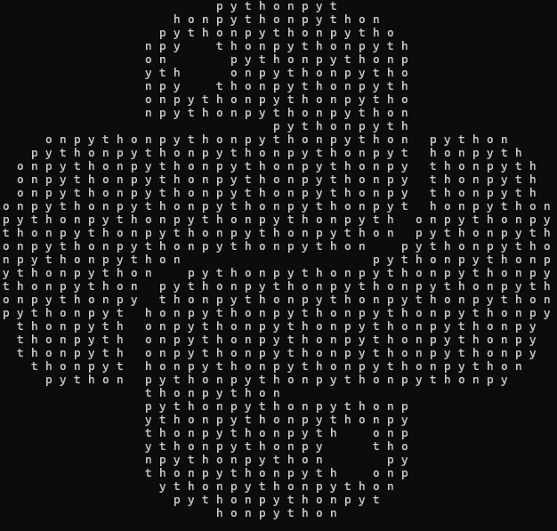

# Description
This Python package formats a piece of text into the shape of a given black and white picture. 
There are optional parameters for text repetition, filler characters, and black pixel detection threshold.

# Installation
If Python is set up, the package can be installed using the following command:
<pre>
pip install text-to-ascii
</pre>

# Usage
Once the package is installed, it is run from the command line using:
<pre>
text-to-ascii &lt;text_path&gt &lt;image_path&gt

OPTIONS:
-c, --copies       Amount of times that the text will loop                     [default: 1]
-f, --filler       The character to fill any extra space                       [default: " "]
-t, --threshold    Pixels less than this value [0-255] are considered black    [default: 220]
</pre>

# Example
This example uses a text file containing the word "python" and black and white image of the Python logo with the option
```--copies 166```:

